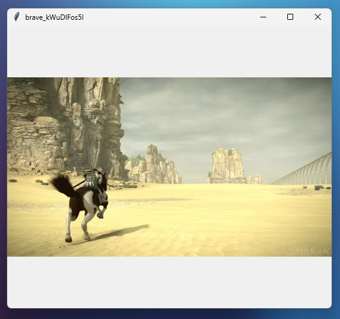

<h1 align=center>Viewport</h1>

A minimal image viewer

  

Viewport is a barebones image viewer program for when you want to view only, in a simple way, a folder of pictures. Downloadable for Windows and Linux. If you want it on Mac, you can probably build it from the source code.

### Installation
1. Download for Windows or Linux from the [releases](https://github.com/telekrex/viewport/releases) page.
2. Extract the .zip and place the application folder where you want it.
3. Run `Viewport.exe`/`Viewport` from in the folder and enjoy. Create shortcuts or desktop files as needed.

Optionally, you can build the application from source yourself.
1. Run `pip install -r .packages` to install dependencies. (`pip3` if on Linux)
1. (If on Linux) you may need to separately install Tk. Run `sudo apt-get install python3-tk -y`
2. Windows build: `python -m PyInstaller --noconsole --onefile viewport.py -n Viewport`
2. Linux build: `python3 -m PyInstaller --noconsole --onefile viewport.py -n Viewport`
The resulting binary will be in `/dist`.

> Note: the icon asssets in this repository and in the build do not quite work. It's an issue with PyInstaller and I have tried fixing it and it seems to be sortof randomly works sometimes, sometimes doesn't. This project is nearly done and this, I don't have the patience to fix. So if you want to tinker with that on your installation go for it.

### How to use
To open a file, press `O`; all pictures in the same folder will be brought with it.  
To refresh, press `R` or resize the window  
To go to next image in folder, press `D` or `right arrow`  
To go to previous image in folder, press `A` or `left arrow`  
To shuffle to random image in folder, press `S`  
Supported formats: `.png`, `.jpg`, `.jpeg`, `.bmp`, `.tif`, `.webp`

### Credits
Written by telekrex under GPL-3.0 license.